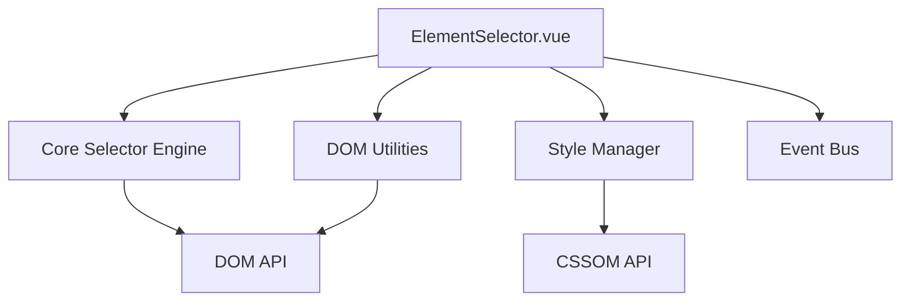

# Design Document

## Overview

元素选择器是一个独立的Vue 3组件，提供可视化DOM元素选择功能。它作为网页微调插件的核心交互模块，采用Composition API和TypeScript构建，确保类型安全和良好的可维护性。

## Steering Document Alignment

### Technical Standards (tech.md)
- 使用Vue 3 Composition API和<script setup>语法
- 完全TypeScript支持，严格类型检查
- 采用pnpm包管理器和Vite构建工具
- 支持离线环境，不依赖CDN资源
- 使用Vitest进行单元测试

### Project Structure (structure.md)
- 组件位于`src/components/element-selector/`目录
- 使用kebab-case命名规范：`element-selector.vue`
- 类型定义在`src/types/element-selector.ts`
- 工具函数在`src/utils/dom-utils.ts`
- 测试文件与源码同目录：`element-selector.spec.ts`

## Code Reuse Analysis

### Existing Components to Leverage
- **Vue 3 Composition API**: 使用ref, reactive, computed等响应式工具
- **CSS Utilities**: 复用现有的样式工具类和设计系统
- **Event Bus**: 使用现有的全局事件系统进行组件通信

### Integration Points
- **DOM API**: 直接使用浏览器原生DOM操作API
- **CSSOM**: 使用CSSStyleDeclaration接口读取和修改样式
- **MutationObserver**: 监听DOM变化以保持选择状态同步

## Architecture

采用分层架构：
1. **核心层**: 纯JavaScript的选择器引擎，处理DOM操作
2. **业务层**: Vue组件，处理用户交互和状态管理
3. **表现层**: UI组件，负责渲染和视觉反馈



## Components and Interfaces

### ElementSelector Component
- **Purpose**: 主组件，协调所有选择器功能
- **Interfaces**: 
  - `enableSelection(): void` - 启用选择模式
  - `disableSelection(): void` - 禁用选择模式
  - `getSelectedElements(): Element[]` - 获取当前选中元素
  - `clearSelection(): void` - 清除所有选择
- **Dependencies**: DOM工具函数、样式管理器、事件系统
- **Reuses**: Vue 3响应式系统、现有UI组件库

### CoreSelector Engine
- **Purpose**: 处理元素选择的核心逻辑
- **Interfaces**:
  - `findElementFromPoint(x: number, y: number): Element | null`
  - `highlightElement(element: Element): void`
  - `selectElement(element: Element): void`
  - `isSelectable(element: Element): boolean`
- **Dependencies**: 原生DOM API

### StyleInfo Component
- **Purpose**: 显示选中元素的样式信息
- **Interfaces**:
  - `showStyles(element: Element): void`
  - `updateStyle(property: string, value: string): void`
  - `getComputedStyles(element: Element): CSSStyleDeclaration`

## Data Models

### ElementSelectionState
```typescript
interface ElementSelectionState {
  selectedElements: Element[];
  activeElement: Element | null;
  isSelectionEnabled: boolean;
  selectionMode: 'single' | 'multiple';
}
```

### ElementStyleInfo
```typescript
interface ElementStyleInfo {
  element: Element;
  tagName: string;
  className: string;
  id: string;
  computedStyles: Record<string, string>;
  inlineStyles: Record<string, string>;
  boundingRect: DOMRect;
}
```

## Error Handling

### Error Scenarios
1. **Scenario 1**: 元素在操作过程中被移除
   - **Handling**: 使用MutationObserver监听元素移除，自动清理无效引用
   - **User Impact**: 显示提示信息，自动清除无效选择

2. **Scenario 2**: 跨域iframe中的元素
   - **Handling**: 检测并阻止跨域操作，显示友好错误提示
   - **User Impact**: 提示用户该元素不可操作

3. **Scenario 3**: 大规模页面性能问题
   - **Handling**: 实现懒加载和虚拟滚动对于样式信息展示
   - **User Impact**: 保持界面响应流畅，提供加载状态指示

## Testing Strategy

### Unit Testing
- 测试核心选择器引擎的DOM操作逻辑
- 验证样式计算和应用的准确性
- 测试边界条件：空选择、无效元素、边缘情况

### Integration Testing
- 测试Vue组件与核心引擎的集成
- 验证事件总线的消息传递
- 测试用户交互流程：悬停、点击、选择

### End-to-End Testing
- 测试完整的选择器工作流程
- 验证跨浏览器兼容性
- 测试性能指标：响应时间、内存使用